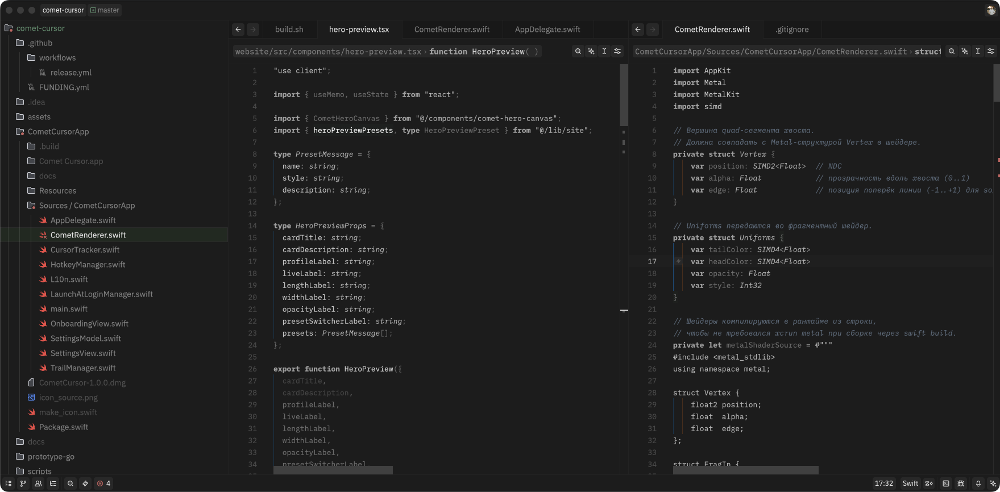

# Umbra

A monochromatic dark theme for [Zed](https://zed.dev) with subtle semantic accents.

## Design

The theme stays strictly monochromatic for syntax — shades of gray create hierarchy without color noise. Color is reserved for semantic meaning only:

- **Green** — created/added lines, git highlights, selected items
- **Red** — errors, deleted lines
- **Amber** — warnings
- **Purple** — merge conflicts, AI predictions
- **Blue-gray** — comments



## Installation

### Via Zed Extensions

Open the command palette and run `zed: extensions`, search for **Umbra** and install.

### Manual

Download `themes/umbra.json` and place it in `~/.config/zed/themes/`. Then set in your `settings.json`:

```json
{
  "theme": "Umbra Dark"
}
```

## Customization

You can override any color in `settings.json` using `experimental.theme_overrides`:

```json
{
  "experimental.theme_overrides": {
    "style": {
      "editor.background": "#0d0d0d"
    }
  }
}
```
