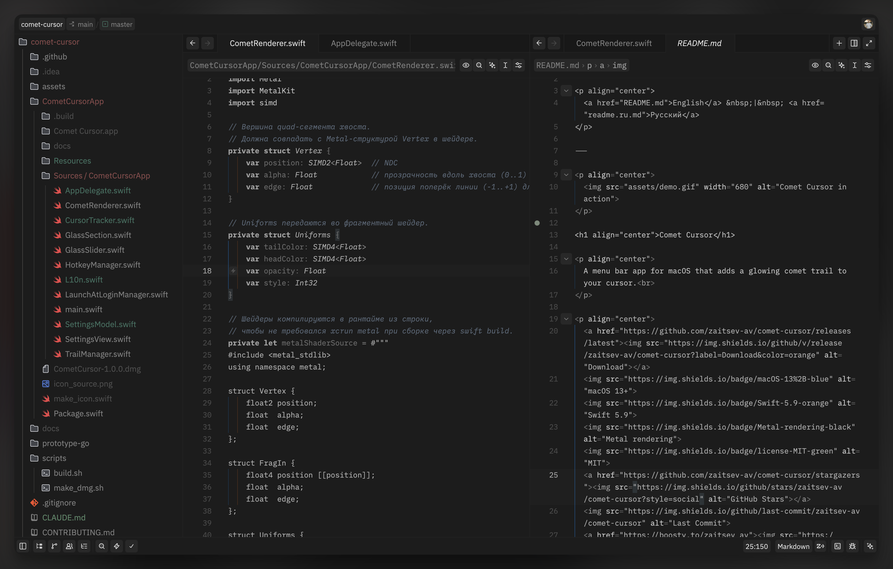
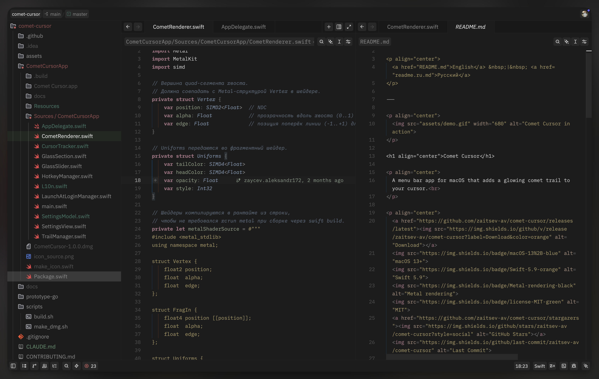

# Umbra

Umbra is a dark theme extension for [Zed](https://zed.dev) with two variants:

- **Umbra Mono** - monochrome syntax with minimal visual noise
- **Umbra Color** - the same base UI palette with colorized syntax highlighting

Both variants preserve semantic UI accents for diagnostics, git changes, and editor states.

## Theme Variants

### Umbra Mono

Monochrome syntax built around contrast and hierarchy.



### Umbra Color

Colorized syntax for better token recognition while keeping Umbra's dark mood.



## Semantic Accents

UI semantic colors are intentionally subtle and consistent across both variants:

- **Green** - created/added lines, success states
- **Red** - errors, deleted lines
- **Amber** - warnings
- **Purple** - conflicts, predictive/AI states
- **Blue-gray** - informational and comment-like contexts

## Installation

### Via Zed Extensions

1. Open the command palette.
2. Run `zed: extensions`.
3. Search for **Umbra** and install it.

### Manual Installation

1. Download `themes/umbra.json`.
2. Place it in `~/.config/zed/themes/`.
3. Choose one of the included themes in `settings.json`:

```json
{
  "theme": "Umbra Mono"
}
```

or

```json
{
  "theme": "Umbra Color"
}
```

## Customization

You can override any theme color in `settings.json` using `experimental.theme_overrides`:

```json
{
  "experimental.theme_overrides": {
    "style": {
      "editor.background": "#0d0d0d"
    }
  }
}
```
